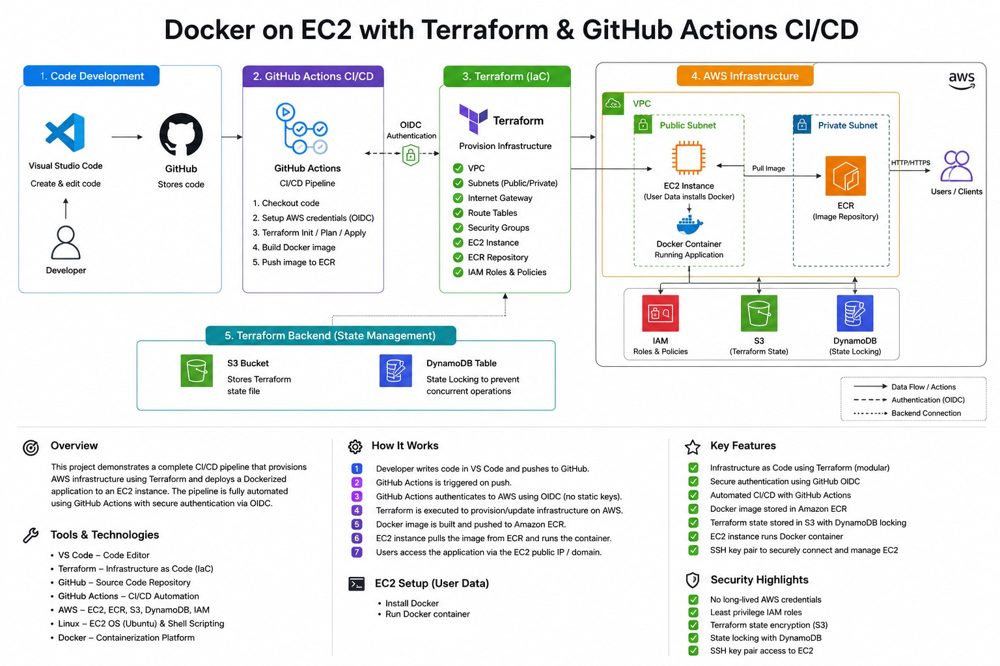

## Project Architecture Diagram



# CI/CD Pipeline for Containerized App on AWS EC2 using Terraform & GitHub Actions

The system automates infrastructure provisioning and application deployment from GitHub to AWS using Terraform and GitHub Actions.

## Overview

This project demonstrates a fully automated CI/CD pipeline deploying a Dockerized application to AWS EC2 using Terraform and GitHub Actions with secure OIDC authentication (no long-lived credentials).

It showcases real-world DevOps practices including Infrastructure as Code, containerization, and secure cloud deployment workflows.

```text
⚙️ How It Works
1. Infrastructure Provisioning (Terraform)
- Creates VPC, subnets, security groups
- Provisions EC2 instance
- Sets up ECR repository
- Configures IAM roles and policies
- Terraform state and locking in S3

2. CI/CD Pipeline (GitHub Actions)
- Triggered on push to main
- Authenticates to AWS using OIDC
- Builds Docker image
- Pushes image to Amazon ECR

3. Deployment
- EC2 pulls latest image from ECR
- Runs container using Docker
- Application is exposed via EC2 public IP
```

🧰 Tech Stack
- Terraform (Infrastructure as Code)
- AWS (EC2, VPC, IAM, ECR, S3)
- Docker
- GitHub Actions (CI/CD)
- Linux
- VS Code

🔐 Security Highlights
- No AWS access keys stored in GitHub
- Secure authentication via OIDC
- Least-privilege IAM roles
- Remote state stored securely in S3 with locking

## 🚀 How to Run It

This project is split into two Terraform stages:

1. **Backend Infrastructure (bootstrap layer)**
2. **Main Infrastructure (application layer)**

The backend bootstraps the AWS environment required for Terraform infra and CI/CD.

```text
cd backend
terraform init
terraform apply
```

It creates:
- S3 bucket for Terraform remote state & state locking
- GitHub OIDC Identity Provider
- IAM role and policies for GitHub Actions authentication

Then deploy the main infrastructure:

```text
cd ../terraform
terraform init
terraform apply
```
---

Terraform File Structure:

```text
AWS-CICD-CONTAINER-PIPELINE/
│
├── backend/                 # Terraform remote state & Github OIDC provider, role and policies bootstrap
├── docker-app/              # Containerized application
├── images/                  # Architecture diagrams
├── terraform/
│   ├── modules/
│   │   ├── vpc/
│   │   ├── subnets/
│   │   ├── security_groups/
│   │   └── ec2/
│   ├── main.tf
│   ├── variables.tf
│   └── outputs.tf
│
├── .github/workflows/       # CI/CD pipeline
├── .gitignore
└── README.md
```
```text
The Terraform state file is a critical component of the infrastructure.
In this setup, the backend bootstrap state (terraform.tfstate) is stored locally, while the main infrastructure state is stored in an S3 bucket with S3-based state locking enabled.

```

