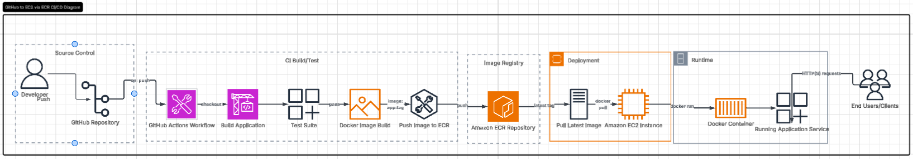

# docker-on-ec2

DEVELOPER --> Github --> Github Actions (CICD) --> OIDC verification --> AWS (ECR, ECR,S3)

## Architecture Diagram

# Docker-on-EC2 CI/CD with Terraform & GitHub Actions

This project demonstrates a complete cloud-native CI/CD pipeline using Terraform, AWS, Docker, and GitHub Actions with secure OIDC authentication.

## Overview

The project automates the provisioning of AWS infrastructure and deployment of a Dockerized application to EC2 using a fully automated CI/CD pipeline.

Infrastructure is defined using Terraform modules, and deployments are triggered via GitHub Actions without the use of long-lived AWS credentials.

## Architecture

- Developer pushes code to GitHub
- GitHub Actions triggers CI/CD pipeline
- AWS authentication is handled securely using OIDC
- Terraform provisions AWS infrastructure (VPC, EC2, ECR, IAM)
- Docker image is built and pushed to Amazon ECR
- EC2 instance pulls image from ECR and runs the container
- Terraform state is stored in S3 with DynamoDB locking

## Key Features

- Infrastructure as Code using Terraform
- Modular architecture (VPC, EC2, Security Groups)
- GitHub Actions CI/CD pipeline
- AWS OIDC authentication (no access keys)
- Docker containerized application deployment
- Amazon ECR for image storage
- EC2-based container runtime
- Remote Terraform backend (S3 + DynamoDB)

## Tech Stack

- Terraform
- AWS (EC2, VPC, IAM, ECR, S3, DynamoDB)
- Docker
- GitHub Actions
- Linux (EC2 Ubuntu/Amazon Linux)

## Security

- No AWS access keys stored in GitHub
- Temporary credentials via OIDC
- Least-privilege IAM roles
- Isolated Terraform state backend